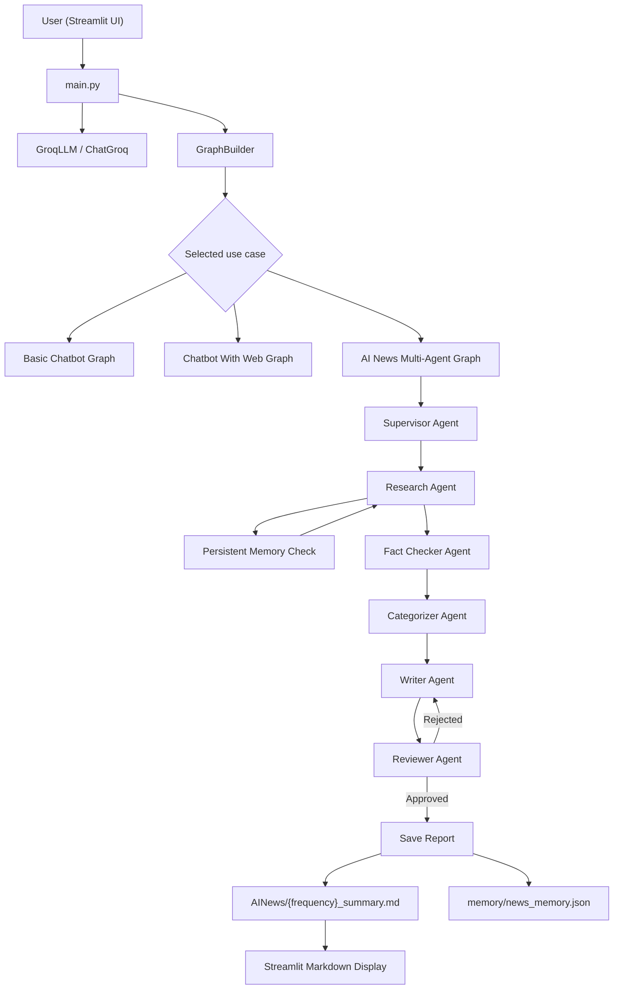
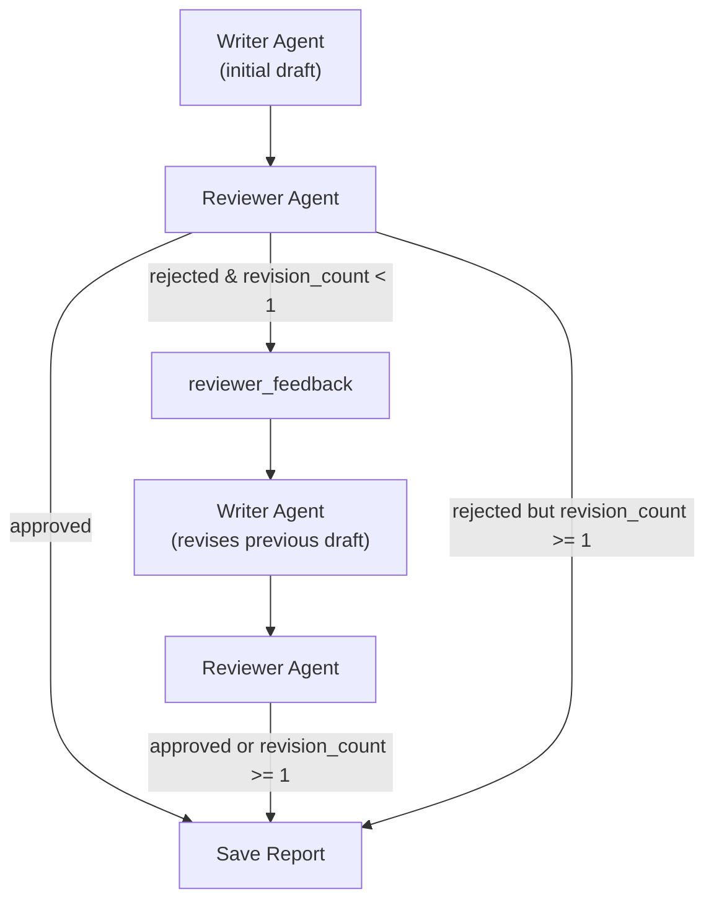
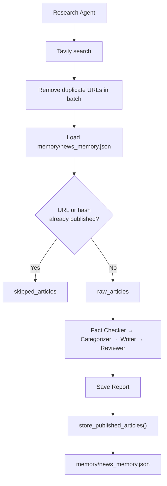
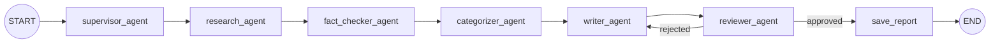

# 🤖 AI Newsroom
### Multi-Agent AI News Intelligence System built with LangGraph

**AI Newsroom** is a portfolio-grade application that combines **LangGraph**, **Groq**, **Tavily**, and **Streamlit** to build stateful, multi-agent AI workflows. Its flagship feature is an automated AI news pipeline: specialized agents research the web, validate articles, categorize stories, write a markdown report, review the draft, and persist results—with duplicate detection across runs.

The project also includes two additional LangGraph use cases—a basic Groq chatbot and a web-search chatbot powered by Tavily tools—demonstrating how the same codebase supports multiple graph topologies from a single Streamlit interface.


---

## Table of Contents

- [Project Overview](#-project-overview)
- [Features](#-features)
- [System Architecture](#-system-architecture)
- [Multi-Agent Workflow](#-multi-agent-workflow)
  - [Supervisor Agent](#supervisor-agent)
  - [Research Agent](#research-agent)
  - [Fact Checker Agent](#fact-checker-agent)
  - [Categorizer Agent](#categorizer-agent)
  - [Writer Agent](#writer-agent)
  - [Reviewer Agent](#reviewer-agent)
  - [Save Report](#save-report)
- [Reflection Loop](#-reflection-loop)
- [Persistent Memory](#-persistent-memory)
- [LangGraph Implementation](#-langgraph-implementation)
- [Additional Use Cases](#-additional-use-cases)
- [Project Structure](#-project-structure)
- [Tech Stack](#-tech-stack)
- [Installation](#-installation)
- [Future Improvements](#-future-improvements)
- [Learning Outcomes](#-learning-outcomes)

---

## 📋 Project Overview

### What problem does this solve?

Staying current on AI news is time-consuming. Articles appear across many sources, overlap in coverage, and vary in quality. Manually curating a readable summary—grouped by topic, linked to sources, and free of duplicates across daily runs—is repetitive work that benefits from automation.

This project automates that workflow: it fetches recent AI news via Tavily, filters and categorizes articles, generates a structured markdown report with Groq, validates the output through a review step, saves the report to disk, and remembers which articles have already been published so repeat runs do not duplicate content.

### Why a multi-agent system?

A single LLM prompt could attempt the entire pipeline, but that approach mixes concerns—search, validation, writing, and quality control—in one step. Splitting responsibilities into dedicated agents makes each stage testable, loggable, and replaceable:

| Concern | Dedicated agent |
| --- | --- |
| Workflow initialization | Supervisor |
| Web retrieval & deduplication | Research |
| Source reliability checks | Fact Checker |
| Topic grouping | Categorizer |
| Narrative report generation | Writer |
| Output quality gate | Reviewer |
| Persistence | Save Report |

LangGraph connects these agents as **nodes** in a **StateGraph**, passing a shared **`NewsState`** between steps and routing conditionally when the reviewer rejects a draft.

### High-level workflow

1. The user selects **AI News** in Streamlit, enters API keys, picks a timeframe, and clicks **Fetch Latest AI News**.
2. LangGraph executes the multi-agent graph sequentially from Supervisor through Save Report.
3. The Research Agent queries Tavily and skips articles already stored in persistent memory.
4. Downstream agents filter, categorize, write, and review the report.
5. If the Reviewer rejects the draft, control returns to the Writer for **one revision**.
6. On approval, the report is saved to `AINews/{frequency}_summary.md` and new article metadata is written to memory.
7. Streamlit reads the saved file and renders it as markdown.

### Main objectives

- Demonstrate **multi-agent orchestration** with LangGraph `StateGraph`
- Use **typed shared state** (`NewsState`) instead of hidden instance variables
- Implement a **reflection loop** (Writer ↔ Reviewer) with conditional routing
- Provide **persistent JSON memory** to avoid republishing the same articles
- Offer **structured logging** for every agent and graph node
- Expose the workflow through a **Streamlit UI** suitable for demos and portfolios

---

## ✨ Features

Only capabilities present in the current codebase are listed below.

| Feature | Description |
| --- | --- |
| **Multi-Agent Architecture** | Seven dedicated agents/nodes for the AI News pipeline |
| **Supervisor Agent** | Initializes `NewsState` and normalizes the news timeframe |
| **AI News Retrieval** | Tavily news search with configurable daily / weekly / monthly windows |
| **Persistent Memory** | JSON-backed store of published articles with URL and hash deduplication |
| **Reflection Loop** | Reviewer can reject once; Writer revises using prior draft + feedback |
| **LangGraph StateGraph** | Compiled graph with typed `NewsState` |
| **Conditional Routing** | `route_after_review` sends rejected reports back to the Writer |
| **Structured Logging** | File + console logs with per-agent timing and state summaries |
| **Markdown Report Generation** | Groq-powered Writer produces categorized summaries with source links |
| **Keyword Categorizer** | Rule-based grouping into four AI-news categories plus a general bucket |
| **Lightweight Fact Checking** | URL scheme, domain, content, and blocked-domain validation |
| **Streamlit Frontend** | Sidebar controls for model, API keys, use case, and news timeframe |
| **Three Use Cases** | Basic Chatbot, Chatbot With Web (Tavily tools), and AI News |
| **Backward-Compatible Facade** | `AINewsNode` re-exports agents for older import paths |

---

## 🏗 System Architecture

The application follows a layered design: Streamlit collects user input, `main.py` configures the Groq LLM and builds the selected graph, agents mutate shared state, and results are displayed or written to disk.



**Execution path for AI News**

| Layer | Module | Role |
| --- | --- | --- |
| Entry | `app.py` | Starts Streamlit via `load_langgraph_agenticai_app()` |
| Orchestration | `main.py` | Loads UI, initializes Groq, builds graph, invokes display |
| Graph | `graph_builder.py` | Defines nodes, edges, conditional routing, compiles graph |
| Agents | `news_agents.py` | Business logic for each pipeline stage |
| State | `state.py` | `NewsState` TypedDict shared across nodes |
| Memory | `memory_manager.py` | Load, filter, and store published article records |
| Logging | `logging_utils.py` | Centralized logger, timers, state snapshots |
| UI | `loadui.py`, `display_result.py` | Sidebar controls and result rendering |

---

## 🤖 Multi-Agent Workflow

The AI News graph is a **linear pipeline** with one **conditional branch** after review. Each agent reads from and writes to `NewsState`. The Supervisor does not dynamically dispatch agents at runtime—the execution order is defined by graph edges in `GraphBuilder.ai_news_builder_graph()`.

### Supervisor Agent

| | |
| --- | --- |
| **Purpose** | Initialize the workflow, normalize the timeframe, and reset pipeline fields |
| **Input** | `messages`, `frequency` (or frequency derived from the first message) |
| **Output** | Initialized state with empty article lists, `review_status: "pending"`, `revision_count: 0` |
| **State updates** | `frequency`, `raw_articles`, `skipped_articles`, `verified_articles`, `categorized_articles`, `markdown_report`, `review_status`, `reviewer_feedback`, `revision_count`, `workflow_status`, `errors`, `no_new_articles`, `memory_skipped_count`, `memory_stored_count` |

Supported frequency aliases include `daily`, `weekly`, `monthly`, and `year` (the Streamlit UI exposes Daily, Weekly, and Monthly only).

---

### Research Agent

| | |
| --- | --- |
| **Purpose** | Fetch AI news from Tavily, deduplicate URLs, and skip articles already in persistent memory |
| **Input** | `frequency` |
| **Output** | New articles only, plus metadata about skipped duplicates |
| **State updates** | `raw_articles`, `skipped_articles`, `no_new_articles`, `memory_skipped_count`, `workflow_status: "research_complete"` |

Tavily is called with:

- **Query:** `"Top Artificial Intelligence (AI) technology news India and globally"`
- **Topic:** `news`
- **Max results:** 20
- **Time range:** mapped from frequency (`d` / `w` / `m` / `y`)

If every retrieved article was previously published, `no_new_articles=True` and downstream agents short-circuit expensive processing where implemented.

---

### Fact Checker Agent

| | |
| --- | --- |
| **Purpose** | Apply lightweight reliability checks before articles reach the Writer |
| **Input** | `raw_articles`, `errors`, `no_new_articles` |
| **Output** | Filtered list of articles that pass validation |
| **State updates** | `verified_articles`, `errors`, `workflow_status` |

Validation rules (deterministic, not LLM-based):

- URL must use `http` or `https` with a valid domain
- Domain must not be in `blocked_domains` (`localhost`, `example.com`)
- Article must have non-empty content or title
- Duplicate URLs within the batch are removed again

If no articles pass, an error message is appended: `"No verified articles were available after fact checking."`

---

### Categorizer Agent

| | |
| --- | --- |
| **Purpose** | Group verified articles into practical AI-news categories using keyword matching |
| **Input** | `verified_articles`, `no_new_articles` |
| **Output** | Dictionary mapping category names to article lists |
| **State updates** | `categorized_articles`, `workflow_status` |

| Category | Example keywords |
| --- | --- |
| Business and Funding | funding, revenue, startup, investment, market |
| Products and Platforms | launch, product, platform, model, tool, app |
| Policy and Safety | regulation, law, policy, safety, lawsuit |
| Research and Infrastructure | research, chip, data center, compute, benchmark |
| General AI News | Default when no keyword matches |

Only categories containing at least one article are kept in the final dictionary.

---

### Writer Agent

| | |
| --- | --- |
| **Purpose** | Generate or revise a professional markdown AI news report using Groq |
| **Input** | `categorized_articles`, `reviewer_feedback`, `revision_count`, `markdown_report`, `no_new_articles` |
| **Output** | Markdown report string |
| **State updates** | `markdown_report`, `revision_count`, `workflow_status` |

On the **first pass**, the Writer prompts Groq to produce an executive summary, category sections, per-article summaries, and source links—using only provided articles.

On **revision**, it receives the previous draft, reviewer feedback, and source articles, and is instructed to preserve strong sections while fixing weak areas.

When `no_new_articles=True`, the Writer returns the fixed string `"No new AI news found."` without calling the LLM.

---

### Reviewer Agent

| | |
| --- | --- |
| **Purpose** | Quality-gate the markdown report before saving |
| **Input** | `markdown_report`, `verified_articles`, `revision_count` |
| **Output** | Approval or rejection with feedback |
| **State updates** | `review_status`, `reviewer_feedback`, `workflow_status` |

Deterministic checks:

| Check | Condition |
| --- | --- |
| Non-empty report | Reject if markdown is empty |
| Source links | Reject if verified articles exist but no `http` links appear |
| Minimum length | Reject if report is under 200 characters with verified articles |
| Headings | Reject if no `##` headings with verified articles |

Rejection triggers **at most one** revision: if `revision_count >= 1`, the report is approved regardless of remaining issues.

---

### Save Report

| | |
| --- | --- |
| **Purpose** | Persist the approved markdown report and update article memory |
| **Input** | `frequency`, `markdown_report`, `categorized_articles`, `no_new_articles` |
| **Output** | File path and memory store count |
| **State updates** | `filename`, `memory_stored_count`, `workflow_status: "report_saved"` |

The report is written to:

```text
./AINews/{frequency}_summary.md
```

Each file begins with a heading such as `# Daily AI News Summary`. When `no_new_articles=True`, the file is still saved but memory is **not** updated.

---

## 🔄 Reflection Loop

The reflection loop implements a simple **generate → critique → revise → approve** pattern. The Reviewer uses rule-based checks rather than an LLM, keeping the loop fast and predictable.

```text
Writer (initial draft)
        ↓
    Reviewer
        ↓
   ┌────┴────┐
   │         │
Rejected   Approved
   │         │
   ↓         ↓
Feedback   Save Report
   ↓
Writer (revision — uses previous draft + feedback)
   ↓
    Reviewer
   (approves after one revision at most)
        ↓
    Save Report
```



LangGraph wiring (`graph_builder.py`):

```python
self.graph_builder.add_conditional_edges(
    "reviewer_agent",
    route_after_review,
    {
        "writer_agent": "writer_agent",
        "save_report": "save_report",
    },
)
```

`route_after_review` returns `"save_report"` when `review_status == "approved"`, otherwise `"writer_agent"`.

---

## 💾 Persistent Memory

### Why memory exists

Without memory, every run would treat the same Tavily results as new content and regenerate reports for articles already published. The `NewsMemoryManager` stores metadata for articles that have been successfully saved, enabling **cross-run duplicate detection**.

### What is stored

Each published article record contains:

| Field | Description |
| --- | --- |
| `title` | Article title from Tavily |
| `url` | Source URL |
| `published_date` | Publication date from the source |
| `processed_timestamp` | UTC ISO timestamp when stored |
| `category` | Category assigned by the Categorizer |
| `article_hash` | SHA-256 fingerprint (see below) |

### Example structure (`memory/news_memory.json`)

```json
{
  "published_articles": [
    {
      "title": "Example AI Startup Raises Series B",
      "url": "https://example.com/ai-startup-funding",
      "published_date": "Mon, 14 Jul 2026 10:00:00 GMT",
      "processed_timestamp": "2026-07-14T11:05:16.969588+00:00",
      "category": "Business and Funding",
      "article_hash": "92822292d88e464ee1ca61bbd840acb43987d023f7e0d67c97438a9388ed166d"
    }
  ]
}
```

### Article hash generation

The hash is computed in `NewsMemoryManager.article_hash()`:

```python
source = "|".join([
    title.strip().lower(),
    url.strip().lower(),
    published_date.strip().lower(),
])
article_hash = hashlib.sha256(source.encode("utf-8")).hexdigest()
```

This allows duplicate detection even if URLs differ slightly but title and date match.

### Duplicate detection

During research, `filter_new_articles()` skips an article if **either**:

- Its URL (case-insensitive) already exists in memory, **or**
- Its `article_hash` already exists in memory

Skipped articles are tracked in `skipped_articles`; the count is exposed as `memory_skipped_count`.

### When memory updates

Memory is updated in **Save Report** via `store_published_articles()`, which iterates categorized articles and appends new records. Updates are **skipped** when `no_new_articles=True`.



---

## 🔗 LangGraph Implementation

### NewsState

Defined in `src/langgraphagenticai/state/state.py` as a `TypedDict` with `total=False` (all fields optional except those always provided at invoke time):

| Field | Type | Role |
| --- | --- | --- |
| `messages` | `Annotated[List, add_messages]` | LangGraph message history |
| `frequency` | `str` | News timeframe (`daily`, `weekly`, `monthly`, …) |
| `raw_articles` | `List[Dict]` | New articles from Research |
| `skipped_articles` | `List[Dict]` | Articles filtered by memory |
| `verified_articles` | `List[Dict]` | Articles passing Fact Checker |
| `categorized_articles` | `Dict[str, List[Dict]]` | Category → articles |
| `markdown_report` | `str` | Generated report body |
| `review_status` | `str` | `"pending"`, `"approved"`, or `"rejected"` |
| `reviewer_feedback` | `str` | Critique text for Writer revisions |
| `revision_count` | `int` | Number of Writer revisions performed |
| `filename` | `str` | Saved report path |
| `workflow_status` | `str` | Human-readable stage marker |
| `errors` | `List[str]` | Accumulated error messages |
| `no_new_articles` | `bool` | True when memory filtered all results |
| `memory_skipped_count` | `int` | Articles skipped due to memory |
| `memory_stored_count` | `int` | Articles newly written to memory |

Chat use cases use a separate, simpler `State` TypedDict with only `messages`.

### Nodes

| Node name | Callable | Agent class |
| --- | --- | --- |
| `supervisor_agent` | `SupervisorAgent.plan` | Supervisor |
| `research_agent` | `ResearchAgent.research` | Research |
| `fact_checker_agent` | `FactCheckerAgent.verify` | Fact Checker |
| `categorizer_agent` | `CategorizerAgent.categorize` | Categorizer |
| `writer_agent` | `WriterAgent.write` | Writer |
| `reviewer_agent` | `ReviewerAgent.review` | Reviewer |
| `save_report` | `SaveReportNode.save` | Save Report |

Each node is wrapped with `_with_node_logging()` to log the current node name and mark graph completion at `save_report`.

### Edges

```text
START → supervisor_agent → research_agent → fact_checker_agent
      → categorizer_agent → writer_agent → reviewer_agent
      → [conditional] → writer_agent | save_report → END
```

### Conditional routing

After `reviewer_agent`, `route_after_review(state)` inspects `review_status`:

- `"approved"` → `save_report`
- otherwise → `writer_agent`

### State updates

LangGraph merges each node's returned dictionary into the accumulated state. Agents return **partial updates**—only the fields they modify—rather than the full state object.

### Graph compilation

`GraphBuilder.setup_graph(usecase)` builds the appropriate graph and returns:

```python
return self.graph_builder.compile()
```

The compiled graph is invoked from Streamlit:

```python
graph.invoke({
    "messages": [HumanMessage(content=frequency)],
    "frequency": frequency.lower(),
})
```

### Execution flow



---

## 💬 Additional Use Cases

Beyond AI News, the same `GraphBuilder` supports two chatbot graphs using the simpler `State` type.

### Basic Chatbot

- **Graph:** `START → chatbot → END`
- **Node:** `BasicChatbotNode.process` invokes Groq with the message history
- **UI:** Standard chat input

### Chatbot With Web

- **Graph:** `START → chatbot ⇄ tools` (loop until no tool call)
- **Tools:** `TavilySearchResults(max_results=2)` via LangChain Community
- **Routing:** LangGraph `tools_condition` decides whether to call tools or end
- **UI:** Requires Tavily API key; displays Human, AI, and Tool messages

These use cases share the Groq LLM configuration and Streamlit sidebar but do not use `NewsState` or the multi-agent news pipeline.

---

## 📁 Project Structure

```text
AI_NEWS_AGENTIC/
├── app.py                          # Streamlit entry point
├── requirements.txt                # Python dependencies
├── README.md
├── memory/
│   ├── __init__.py
│   ├── memory_manager.py           # JSON memory load/filter/store
│   └── news_memory.json            # Published article records
├── logs/
│   └── ai_news.log                 # Runtime logs (created at execution)
├── AINews/
│   └── {frequency}_summary.md      # Generated reports (daily, weekly, monthly)
└── src/
    └── langgraphagenticai/
        ├── main.py                 # App orchestration
        ├── agents/
        │   ├── __init__.py
        │   └── news_agents.py      # All AI News agents + route_after_review
        ├── graph/
        │   └── graph_builder.py    # StateGraph definitions for all use cases
        ├── state/
        │   └── state.py            # State and NewsState TypedDicts
        ├── nodes/
        │   ├── ai_news_node.py     # Backward-compatible import facade
        │   ├── basic_chatbot_node.py
        │   └── chatbot_with_Tool_node.py
        ├── tools/
        │   └── search_tool.py      # Tavily tool setup for web chatbot
        ├── LLMS/
        │   └── groqllm.py          # ChatGroq initialization
        ├── utils/
        │   ├── __init__.py
        │   └── logging_utils.py    # Logger, timers, state summaries
        └── ui/
            ├── uiconfigfile.ini    # Page title, model, and use case options
            ├── uiconfigfile.py     # ConfigParser wrapper
            └── streamlitui/
                ├── loadui.py       # Sidebar and AI News controls
                └── display_result.py  # Graph invoke and result display
```

| Folder / file | Responsibility |
| --- | --- |
| `app.py` | Delegates to `load_langgraph_agenticai_app()` |
| `agents/news_agents.py` | Core multi-agent business logic |
| `graph/graph_builder.py` | Wires nodes, edges, conditional routing, logging wrappers |
| `state/state.py` | TypedDict definitions for graph state |
| `memory/` | Cross-run duplicate detection for published articles |
| `utils/logging_utils.py` | Centralized logging to `logs/ai_news.log` and stdout |
| `ui/streamlitui/` | Streamlit layout, API key inputs, fetch button, markdown display |
| `AINews/` | Output directory for saved markdown summaries |

---

## 🛠 Tech Stack

| Technology | Purpose |
| --- | --- |
| **Python** | Application language |
| **LangGraph** | `StateGraph`, node/edge wiring, conditional routing, graph compilation |
| **LangChain Core** | `ChatPromptTemplate`, message types (`HumanMessage`, `AIMessage`, `ToolMessage`) |
| **LangChain Groq** | `ChatGroq` integration for the Writer and chatbots |
| **LangChain Community** | `TavilySearchResults` tool for the web chatbot |
| **Groq** | Hosted LLM inference (models configured in `uiconfigfile.ini`) |
| **Tavily** | News search in Research Agent; web search in Chatbot With Web |
| **Streamlit** | Frontend: sidebar controls, chat input, fetch button, markdown rendering |
| **ConfigParser** | Reads UI options from `uiconfigfile.ini` |

**Available Groq models** (from config): `openai/gpt-oss-20b`, `openai/gpt-oss-120b`, `qwen/qwen3.6-27b`

---

## 🚀 Installation

### 1. Clone the repository

```bash
git clone https://github.com/your-username/ai-newsroom.git
cd ai-newsroom/AI_NEWS_AGENTIC
```

### 2. Create a virtual environment

```bash
python -m venv venv

# Windows
venv\Scripts\activate

# macOS / Linux
source venv/bin/activate
```

### 3. Install dependencies

```bash
pip install -r requirements.txt
```

### 4. Set environment variables

API keys are entered in the Streamlit sidebar at runtime. The app also sets `TAVILY_API_KEY` in `os.environ` when provided.

| Key | Required for | Obtain from |
| --- | --- | --- |
| `GROQ_API_KEY` | All use cases | [Groq Console](https://console.groq.com/keys) |
| `TAVILY_API_KEY` | Chatbot With Web, AI News | [Tavily](https://app.tavily.com/home) |

### 5. Run the application

```bash
streamlit run app.py
```

Run this command from the `AI_NEWS_AGENTIC` directory so relative paths (`./memory/`, `./AINews/`, `./logs/`) resolve correctly.

### Expected output

1. Streamlit opens in the browser with the title **LangGraph: Build Stateful Agentic AI graph**
2. Select **AI News** from the use case dropdown
3. Enter your Groq and Tavily API keys
4. Choose **Daily**, **Weekly**, or **Monthly**
5. Click **Fetch Latest AI News**
6. A spinner appears while agents run; the saved markdown report renders in the main panel
7. Logs are written to `logs/ai_news.log`

Example terminal log excerpt:

```text
2026-07-14 11:05:00 | INFO | [GraphBuilder] Current Node: supervisor_agent
2026-07-14 11:05:01 | INFO | [Supervisor] Started
2026-07-14 11:05:02 | INFO | [GraphBuilder] Current Node: research_agent
2026-07-14 11:05:05 | INFO | [Research] Retrieved 20 articles
2026-07-14 11:05:10 | INFO | [GraphBuilder] Conditional routing decision after Reviewer: save_report
2026-07-14 11:05:10 | INFO | [GraphBuilder] END reached
```

If all retrieved articles were previously published, the displayed report will contain:

```text
No new AI news found.
```

---

## 🔮 Future Improvements

Realistic enhancements not yet implemented:

| Improvement | Rationale |
| --- | --- |
| **LLM-based Reviewer** | Replace deterministic checks with semantic quality evaluation |
| **Stronger fact checking** | Source allowlists, claim cross-referencing, or retrieval-augmented verification |
| **Evaluation framework** | Automated metrics for report quality, citation accuracy, and category precision |
| **Additional news sources** | Combine Tavily with RSS feeds, vendor APIs, or custom crawlers |
| **Report export formats** | PDF, HTML, or email digest in addition to markdown |
| **Dashboard analytics** | Charts for articles per category, memory growth, and run history |
| **Automated tests** | Unit tests for agents, memory manager, and routing logic |
| **Yearly timeframe in UI** | Code supports `year` frequency; expose it in Streamlit |
| **Retry and error recovery** | Resilience for Tavily or Groq API failures |

---

## 🎓 Learning Outcomes

This project demonstrates practical concepts for developers learning agentic AI:

| Concept | How it appears in this codebase |
| --- | --- |
| **Multi-Agent Systems** | Specialized agents with single responsibilities orchestrated in sequence |
| **LangGraph** | `StateGraph`, node registration, edge wiring, `compile()`, `invoke()` |
| **Reflection Loops** | Writer ↔ Reviewer cycle with feedback-driven revision |
| **Persistent Memory** | JSON store with hash-based deduplication across executions |
| **Agent Collaboration** | Each agent reads prior state and returns partial updates |
| **State Management** | Typed `NewsState` replaces hidden instance dictionaries |
| **Conditional Routing** | `add_conditional_edges` and `route_after_review` |
| **Tool Integration** | Tavily search in both the web chatbot and Research Agent |
| **Structured Logging** | Per-agent timing, state snapshots, and exception tracebacks |
| **UI Integration** | Streamlit triggers graph execution and renders persisted output |

---

<p align="center">
  Built with LangGraph · Groq · Tavily · Streamlit
</p>
